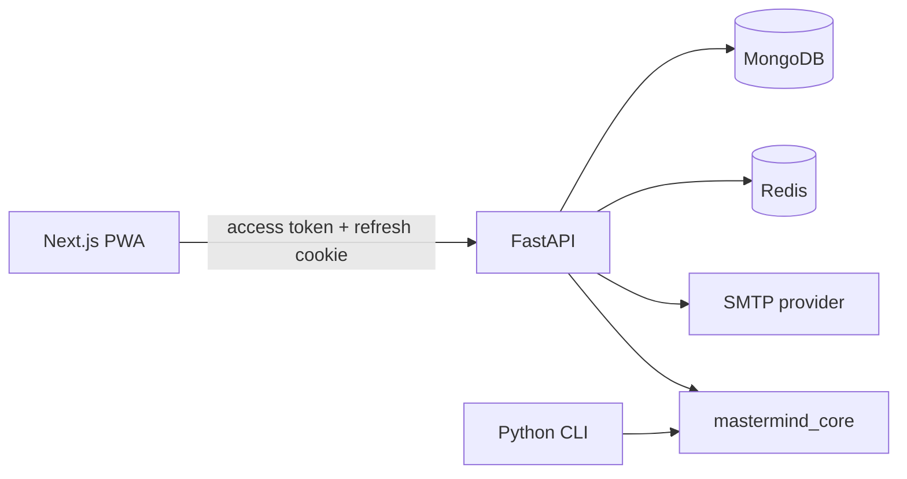

# Cipherboard

Cipherboard is a production-oriented, accessible Mastermind product: a responsive Next.js PWA, a versioned FastAPI service, a canonical Python rules engine, MongoDB persistence, Redis-backed private duels, first-party authentication, and the original SBA command-line application.



MongoDB is authoritative for identities, sessions, games, attempts, rooms, durable replay events, scores, achievements, flags, and audit events. Redis coordinates rate limits, presence, one-use WebSocket tickets, and fan-out; it is not a source of truth. AES-256-GCM protects game secrets. Daily puzzles derive from a versioned server HMAC.

## Repository

```text
apps/api/                 FastAPI, first-party auth, PyMongo, WebSockets
apps/web/                 Next.js App Router PWA
packages/mastermind_core/ Canonical Python rules and CLI
packages/api_client/      Generated TypeScript API contract
packages/shared_config/   Public web configuration validation
infra/                    Containers and operational scripts
tests/                    API, core, load, and integration tests
docs/                     Architecture, security, privacy, and operations
```

## Requirements

- Python 3.13 and uv 0.11.23
- Node 24.18 and pnpm 10.28.2
- Docker with Compose for local MongoDB, Redis, and Mailpit
- For hosted use: MongoDB Atlas (or another TLS MongoDB deployment), TLS Redis, an SMTP service, and managed secrets

### Guided desktop installers

The release archives provide guided macOS and Windows installers for the GUI and CLI. They ask for the installation folder, generate local authentication and encryption keys, build and start MongoDB, Redis, Mailpit, the API, and the web application, create launchers, verify readiness, and write a report describing what was installed and how to use it.

See [desktop installers](docs/operations/DESKTOP_INSTALLERS.md) for installation, CLI/GUI usage, service management, data locations, and release packaging.

## Local setup

```bash
cp .env.example .env
infra/scripts/bootstrap-local-env.sh
uv sync --all-extras --frozen
pnpm install --frozen-lockfile
docker compose up --build
```

The bootstrap script generates development-only auth and cryptographic keys. If a MongoDB URI is already on the clipboard, pass it safely without printing it:

```bash
pbpaste | infra/scripts/bootstrap-local-env.sh --mongodb-uri-stdin
```

Mailpit is available at `http://localhost:8025`. The API is at `http://localhost:8000`, the PWA at `http://localhost:3000`, and API documentation at `http://localhost:8000/docs`.

Initialize or reconcile collections and indexes without starting the full stack:

```bash
uv run mastermind-initialize
```

This operation is idempotent. It creates missing collections, indexes, and seed documents; it does not delete application data.

## CLI

```bash
uv run python -m mastermind_cli
```

The CLI stores UTF-8 scores in `data/high_scores.csv`. Interactive terminals display each peg identifier in its matching colour while preserving the letters for accessibility. Redirected output remains plain text; set `NO_COLOR=1` to disable ANSI styling or `FORCE_COLOR=1` to enable it explicitly. The CLI supports all presets, Custom, computer/human Code Maker, safe input normalization, complete history, score sorting, export, `quit`, EOF, and interrupt handling. See the [SBA implementation](docs/sba/SBA_IMPLEMENTATION.md).

The complete illustrated SBA submission is available as a [PDF report](docs/sba/mastermind-game-system-report/Mastermind_Game_System_SBA_Report.pdf) and an [editable Word report](docs/sba/mastermind-game-system-report/Mastermind_Game_System_SBA_Report.docx). Its source, figures, and reproducible build tools are in the [report directory](docs/sba/mastermind-game-system-report/).

## Development checks

```bash
uv run ruff format --check .
uv run ruff check .
uv run mypy .
uv run pytest
pnpm validate
```

API tests use short-lived isolated MongoDB databases and delete only the exact database created by each test fixture.

## Authentication

The API owns guest identities, email magic links, access-token signing, refresh-token rotation, session revocation, and TOTP MFA. Access tokens are short lived and held in browser memory. Refresh tokens are opaque, hashed in MongoDB, rotated on every use, and delivered only in an HttpOnly cookie scoped to `/v1/auth`.

Email delivery uses the configured SMTP server. Production must use a monitored sender domain and provider credentials; Mailpit is development-only.

## Production

Production uses the hardened images under `infra/docker`, MongoDB and Redis over TLS, exact HTTPS origins, Secure cookies, a random auth signing key, an SMTP provider, backup/PITR, and protected deployment environments. The release profile runs `mastermind-initialize` before shifting traffic.

See [environment variables](docs/operations/ENVIRONMENT_VARIABLES.md), [deployment](docs/operations/DEPLOYMENT.md), [database changes](docs/operations/MIGRATIONS.md), and [verification](docs/operations/VERIFICATION.md).
