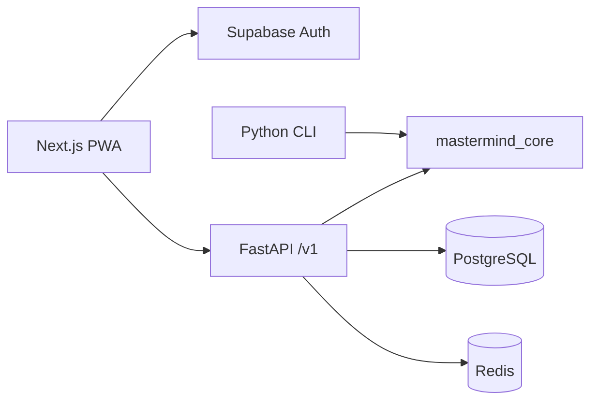

# Cipherboard

Cipherboard is a production-oriented, accessible Mastermind product: a responsive PWA, a versioned FastAPI service, a canonical Python rule engine, PostgreSQL persistence, Redis-backed private duels, Supabase guest and linked accounts, and the original SBA command-line application.

Players can begin with a real anonymous identity, play official or custom solo games, complete one fair daily run, send encrypted friend challenges, join two-player real-time duels, compare authoritative leaderboards, manage privacy, export data, and delete their account. Staff operations are protected and audited.

The repository was initialized as a greenfield monorepo because the configured GitHub repository had no prior application or history. `main` is the authoritative integration branch.

## Architecture



The API and CLI import the same pure Python engine. PostgreSQL is authoritative for games, attempts, rooms, safe event replay, scores, achievements, flags, and audit events. Redis coordinates rate limits, presence, one-use WebSocket tickets, and horizontal fan-out; it is not a source of truth. AES-256-GCM protects standard game and human challenge secrets. Daily puzzles derive deterministically from a versioned server HMAC.

Read [system overview](docs/architecture/SYSTEM_OVERVIEW.md), [API design](docs/architecture/API_DESIGN.md), [data model](docs/architecture/DATA_MODEL.md), [real-time design](docs/architecture/REALTIME.md), and [threat model](docs/security/THREAT_MODEL.md).
Contribution and private vulnerability-reporting workflows are in [CONTRIBUTING.md](CONTRIBUTING.md) and [SECURITY.md](SECURITY.md).

## Features

- Easy, Normal, Hard, Expert, Custom, Practice, pass-and-play, daily, friend, and private duel modes.
- Duplicate-safe `O(n)` feedback, validated immutable attempts, legal state transitions, and versioned `score_v1`.
- Anonymous guest identities, email upgrade, profile visibility, real statistics, achievements, export, and deletion.
- UTC daily challenge with one official run, refresh restoration, unranked replay, and daily ranking.
- High-entropy friend/room invites stored as hashes; encrypted secrets; creator revocation and expiry.
- Authenticated WebSockets with one-use tickets, heartbeat, durable sequence replay, private guesses, and a server-timestamp tie window.
- Daily, weekly, all-time, and difficulty leaderboards with stable ties and moderation filtering.
- English and Traditional Chinese, light/dark appearance, colour-independent symbols, keyboard play, live feedback announcements, reduced motion, and 44px controls.
- Installable PWA shell with an honest offline explanation and safe current-row preservation.
- Protected admin operations, first-party privacy-limited analytics, typed flags, structured logging, metrics, health/readiness, rate limits, and audit trails.
- Multi-stage non-root containers, GitHub Actions, Alembic, backup/restore/key-rotation/runbooks, k6 profiles, and complete SBA documentation.

## Project structure

```text
apps/
  api/                 FastAPI, SQLAlchemy, Alembic and WebSockets
  cli/                 SBA command-line application
  web/                 Next.js application and PWA
packages/
  mastermind_core/     canonical Python rules
  api_client/          OpenAPI-generated TypeScript contract
  shared_config/       browser-safe shared product configuration
infra/
  docker/              production image definitions
  scripts/             guarded development and operations helpers
docs/                  architecture, product, SBA, security and operations
tests/                 Python, browser and load verification
```

## Prerequisites

- Node.js `24.18.0` and pnpm `10.28.2` (`.node-version` and `packageManager` are authoritative).
- Python `3.13.14` and uv.
- Docker and Docker Compose.
- A Supabase project with anonymous sign-in enabled, asymmetric JWT signing, and a publishable browser key. Production also requires managed PostgreSQL, Redis, and secret management.

The workstation used for this delivery had Node 20 and Python 3.14; the repository pins supported production versions instead of inheriting those local versions.

## Configuration

```bash
cp .env.example .env
```

Fill the documented non-secret and development values. Generate AES and HMAC keys as described in [environment variables](docs/operations/ENVIRONMENT_VARIABLES.md). Never expose a Supabase service-role key or API secret through a `NEXT_PUBLIC_` variable.

Production deployment sets `VALIDATE_LAUNCH_CONFIGURATION=true`; startup then refuses missing legal entity, jurisdiction, support, policy date, and production security values.

## Install

```bash
pnpm install --frozen-lockfile
uv sync --frozen --all-extras
```

### Guided desktop installers

Release archives include guided macOS and Windows installers for both the GUI and CLI. They ask for the installation folder, install and start the complete local service stack, create launchers, verify readiness, and write a report describing everything installed and how to use it. Docker Desktop is the only system-level prerequisite; if it is missing, the installer offers to install the official signed package.

See [desktop installers](docs/operations/DESKTOP_INSTALLERS.md) for installation, CLI/GUI usage, service management, data locations, and release packaging.

## Local development

One command builds and starts PostgreSQL, Redis, the migrated API, and the web application:

```bash
pnpm dev:all
```

For split-process development:

```bash
docker compose up -d postgres redis
uv run alembic -c apps/api/alembic.ini upgrade head
uv run uvicorn mastermind_api.main:app --app-dir apps/api --reload
pnpm dev
```

Open `http://localhost:3000/en`; API docs are at `http://localhost:8000/docs`. Readiness is `http://localhost:8000/health/ready`.

The managed/local Supabase Auth issuer must match `MASTERMIND_SUPABASE_URL`. Anonymous play is deliberately not replaced by a browser-only development identifier.

## CLI

```bash
uv run python -m mastermind_cli
```

The CLI stores UTF-8 scores in `data/high_scores.csv`. It supports all presets, Custom, computer/human Code Maker, safe input normalization, complete history, score sorting, export, `quit`, EOF, and interrupt handling. See [SBA implementation](docs/sba/SBA_IMPLEMENTATION.md).

## Database and migrations

```bash
uv run alembic -c apps/api/alembic.ini upgrade head
uv run alembic -c apps/api/alembic.ini current
uv run alembic -c apps/api/alembic.ini downgrade -1
```

Alembic is the sole application-schema authority. The API does not create schema at startup. Use a migration-owner credential for Alembic and a least-privilege runtime credential for the API. Review [migrations](docs/operations/MIGRATIONS.md) before any production change.

## Validation

Python:

```bash
uv run ruff format --check .
uv run ruff check .
uv run mypy apps packages
uv run pytest
uv run pytest tests/core --cov=mastermind_core --cov-branch --cov-fail-under=95
```

Web:

```bash
pnpm lint
pnpm typecheck
pnpm test
pnpm build
pnpm test:e2e
pnpm test:a11y
```

Contracts, containers, and load profile:

```bash
pnpm generate:api
docker compose build
docker compose up -d
pnpm test:load
```

See [testing operations](docs/operations/TESTING.md) for integration-service requirements and exact CI jobs. A command is not considered passing unless its process exits successfully.

## Production build and deployment

```bash
docker compose build api web
```

Production uses the images in `infra/docker`, managed PostgreSQL and Redis, managed TLS/secrets, exact CORS origins, asymmetric Supabase JWTs, backup/PITR, and protected deployment environments. Apply migrations as a separate release step before shifting traffic. Then verify live/readiness, guest play, secret omission, leaderboard integrity, and one two-client duel.

Provider-neutral requirements and a concrete container path are documented in [deployment](docs/operations/DEPLOYMENT.md). Dashboard metrics and example queries are in [observability](docs/operations/OBSERVABILITY.md). Use [rollback](docs/operations/ROLLBACK.md) when application or migration health gates fail.

## Troubleshooting

- **`AUTH_NOT_CONFIGURED`**: set public Supabase URL/publishable key in the web environment and the matching issuer/audience in the API.
- **Readiness is degraded**: inspect database and Redis health separately; ranked and real-time mutations fail closed when coordination integrity cannot be guaranteed.
- **Secret decryption error**: do not generate a replacement key. Restore the expected key version through secret management and follow [key rotation](docs/operations/KEY_ROTATION.md).
- **Generated client drift**: start the API, run `pnpm generate:api`, and inspect the resulting schema change.
- **Migration refuses reset**: destructive helpers intentionally reject non-local database hosts.
- **Fonts fail during an offline build**: build in the documented network-enabled dependency stage or vendor approved font assets before a fully offline build.

## Security reporting

Do not open a public issue for a suspected vulnerability. Send a minimal report to the configured `NEXT_PUBLIC_SUPPORT_EMAIL` with the affected route/version and reproduction steps, omitting active secrets, tokens, real personal data, and exploit traffic against other users. Operators follow [incident response](docs/operations/INCIDENT_RUNBOOK.md) and [security controls](docs/security/SECURITY_CONTROLS.md).

## Legal and launch configuration

Privacy, terms, accessibility, and support pages describe the implementation but require final legal review for the configured entity and jurisdiction. The launch checklist blocks production until domains, managed services, secrets, support address, policy dates, backups, legal review, accessibility review, and production load evidence are complete.
