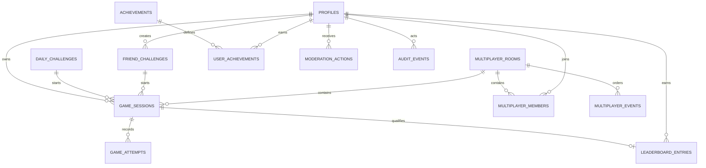

# Data model

## Persistence boundary

PostgreSQL is the system of record. The browser never connects to application tables directly; FastAPI authenticates each request, authorizes the resource, and performs the transaction through SQLAlchemy. Supabase supplies identity only. Its Data API is disabled for this project, and application migrations revoke table/function privileges from `PUBLIC`, `anon`, and `authenticated` before granting a least-privilege runtime role.

Supabase Auth and the application database may be separate managed PostgreSQL services. `profiles.id` stores the verified UUID from the JWT `sub` claim, so application integrity does not depend on a cross-database foreign key to `auth.users`.

All timestamps are UTC `timestamptz`. Internal identifiers are UUIDs. User-facing identifiers are independent, non-sequential values. Configuration, rules, scoring, daily derivation, and achievement definitions are versioned so historical results remain interpretable.

## Entity map

## Tables and invariants

### `profiles`

The primary key equals the authenticated Supabase subject. A profile contains a bounded display name and normalized form, guest status, public leaderboard preference, moderation state, and deletion timestamp. Display names are NFKC-normalized, reject control and bidirectional formatting characters, and are escaped at render time. Authentication email, OAuth tokens, and refresh tokens are not copied into this table.

Deleting an account first hides and anonymizes the profile, then removes the Auth identity. Historical integrity records may retain an unidentifiable profile UUID for the retention window; public output uses an anonymous label.

### `game_sessions`

A session contains its owner, mode, versioned configuration snapshot, state, timing, fixed `expires_at` deadline, attempt count, score breakdown, ranking eligibility, optional challenge/room relationship, and encrypted secret material. The deadline is constrained after `started_at`; friend and duel sessions never outlive their parent capability. Creation rows for games, friend challenges, and rooms also store a request fingerprint beside the client idempotency key; reusing a key with different normalized creation input is rejected. Active secrets are stored as AES-256-GCM ciphertext, a 96-bit nonce, and key version. Associated authenticated data binds ciphertext to the record identifier and rules version.

Allowed transitions are `created → active`, then `active → won|lost|abandoned|expired`. Terminal sessions reject attempts. Database checks bound maximum attempts to 1–20 and prevent negative counters. The service validates the full configuration because cross-field rules such as “colours at least code length when duplicates are disabled” are domain invariants.

The following uniqueness constraints protect official-run integrity:

- owner plus creation idempotency key;
- owner plus daily challenge for the one official run;
- owner plus friend challenge for the one official run;
- owner plus room for one duel session per member.

If practice runs share these foreign keys, the constraints must be partial on `is_official`; otherwise practice sessions omit the official challenge relationship and retain it as non-authoritative metadata.

### `game_attempts`

Attempts are immutable after insert. Each stores a normalized stable-colour identifier array, feedback, server timestamp, request identifier, and idempotency key. Unique `(game_id, attempt_number)` and `(game_id, idempotency_key)` constraints prevent duplicate turns. An idempotency request fingerprint is stored with the key so reuse with a different guess returns a conflict rather than the previous response.

Attempt submission locks the session row in a database transaction, checks authorization and an existing idempotency result, validates the guess, inserts the next attempt, performs terminal transition/scoring/achievement/leaderboard work, commits, and only then publishes an event.

### `daily_challenges`

There is one row per `(UTC date, rule-set version)`. The row stores public challenge identity, configuration, derivation version, and `derivation_key_version`. Daily creation records the active version once; starts and replays select that recorded key from the deployed key ring, so a rotation cannot change an already published day. The server derives the secret from HMAC material and does not store seed material or the derived secret.

### `friend_challenges`

The creator, sanitized title, visibility choice, configuration, encrypted secret, revocation time, and expiry are stored. Invite material is at least 192 random bits. Only its SHA-256 digest is persisted; plaintext is returned once at creation. Lookup hashes the submitted token and compares it using the unique indexed digest. Database UUIDs and creator email are never exposed.

### `multiplayer_rooms`, `multiplayer_members`, and `multiplayer_events`

Rooms contain configuration, encrypted secret, authoritative state, winner/tie information, monotonically increasing event sequence, and expiry. Room invite material is high entropy and stored only as a digest. Membership is unique by `(room_id, user_id)` and durably records `ready` plus the server-assigned `ready_at` timestamp. A locked room transaction activates the duel only after both members are ready and creates at most one room-bound game per member. Each safe event is unique by `(room_id, sequence)` and supports bounded reconnect replay. Opponent guesses and secret material are not valid event payload fields, and a member's game identifier is disclosed only to that member.

Redis carries presence, rate-limit counters, short-lived connection tickets, distributed locks, and pub/sub fan-out. It is not the durable game ledger.

### `leaderboard_entries`

At most one entry exists per eligible game. It snapshots score, attempts, validated elapsed time, completion time, category, and review state. Queries additionally join the current profile visibility and moderation state. Ranked ordering is:

1. score descending;
2. attempts ascending;
3. elapsed time ascending;
4. completion time ascending;
5. entry UUID ascending for stable pagination.

Useful indexes begin with category or daily date and then follow this ordering, limited to approved entries. The outer page query explicitly orders by computed rank and immutable entry UUID; a profile with multiple eligible rows receives the best (minimum) rank. Fifteen-second Redis entries cache the complete user-scoped response and fail open to PostgreSQL if caching is unavailable. Custom, guest-public, banned, deleted, opted-out, invalidated, and under-review records are excluded from public boards.

### `product_events`

Consent-gated first-party analytics use a deliberately non-extensible table: an idempotent client event UUID, an allowlisted event name, coarse allowlisted gameplay outcome fields, release/consent versions, occurrence time, and expiry time. There is no profile/user identifier, IP, arbitrary JSON, email, title, guess, token, secret, or free-text field. The runtime role can insert but cannot read, update, or delete these rows; a separately provisioned retention/analytics operator performs bounded aggregate reads and expiry deletion.

### Achievements, feature flags, moderation, and audit

`user_achievements` is unique by user and achievement key, making transactional awarding idempotent. Feature flags have safe defaults and database changes produce audit events. Environment overrides may force risky features off, but never grant authorization.

Every administrative mutation records actor, action, target, timestamp, and bounded reason in the same transaction as its target change. Audit payloads exclude credentials, secret codes, guesses, invite tokens, ciphertext, emails, and raw IP addresses.

## Index plan

- `game_sessions(owner_id, created_at desc)` for history;
- `game_sessions(status, expires_at)` for bounded active expiry scans;
- `game_sessions(completed_at)`, `(friend_challenge_id, completed_at)`, and `(room_id)` for bounded retention and safe relationship detachment;
- the attempt uniqueness indexes described above;
- `daily_challenges(challenge_date, rule_set_version)` unique;
- challenge and room token digests unique, plus challenge expiry and room `(status, expires_at|updated_at)` retention indexes;
- `multiplayer_events(room_id, sequence)` unique;
- leaderboard rank tuple indexes per category and daily date for approved rows;
- `user_achievements(user_id, achievement_key)` unique;
- `user_achievements(game_id)` for clearing retained achievement links before game deletion;
- `audit_events(created_at desc)` and `(actor_id, created_at desc)`.

Index usage is checked with representative `EXPLAIN (ANALYZE, BUFFERS)` queries before launch. Indexes that support foreign-key deletion lookups are required even when not used by a public read path.

## Deletion behavior

Game attempts cascade with their session. Room members/events cascade with an expired room after its retention period. Official daily definitions are restricted while referenced. Friend challenge deletion revokes access immediately; completed game history remains according to the retention policy with the relationship anonymized. Account deletion never cascades blindly through integrity, anti-cheat, or audit records; the deletion service applies the documented anonymization transaction explicitly.

## Migration ownership

Alembic under `apps/api/alembic` is the only application schema history. Supabase CLI migrations are intentionally unused. Production does not run schema creation or migrations at API startup. A release job uses a separate migrator credential. The API workload login owns no objects and receives only the non-login `mastermind_runtime` group's required DML/RLS privileges. A separately provisioned maintenance login inherits `mastermind_retention`, whose grants and RLS policies are limited to lifecycle updates and ordered deletion of the retained tables.
