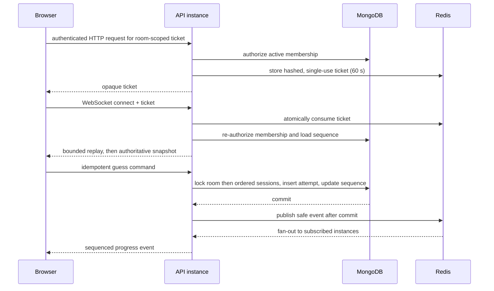

# Real-time architecture

## Authority and data flow

MongoDB owns room membership, session attempts, winner state, and the replayable safe-event sequence. Redis coordinates horizontally scaled API instances; clients never write Redis and Redis loss cannot change a winner.

## Connection authentication

Browser WebSocket APIs cannot reliably attach an `Authorization` header, and JWTs or tickets in query strings leak into access logs and monitoring. The client first calls authenticated `POST /v1/rooms/{room_id}/ws-ticket`. The API returns `{ "ticket": "…", "expiresAt": "UTC timestamp" }` and stores only a digest of the cryptographically random, room- and profile-scoped ticket in Redis for 60 seconds. The client connects to `WS /v1/rooms/{room_id}/events?after={last_sequence}` and offers the subprotocols `cipherboard-v1` and `ticket.{ticket}`. The server accepts only `cipherboard-v1`; the credential is never echoed as the negotiated protocol. Connection establishment atomically consumes the ticket and rechecks room membership, room status, account restriction, and expiry in MongoDB. A ticket is single-use and cannot authorize another room. Access JWTs and WebSocket tickets are never placed in the WebSocket URL.

Reconnect requires a fresh ticket and the last applied sequence. After subscribing to live fan-out, the server reads at most 200 durable events strictly above the cursor and at or below the transactionally captured snapshot sequence. It sends those events in order and then sends the authoritative snapshot; events produced after that sequence were already queued by the subscription. If the requested sequence is ahead of the room or the bounded gap is exceeded, the server sends the snapshot plus a versioned `resync_required` instruction instead of silently truncating replay. The browser rejects every non-snapshot sequence at or below its last applied value, including a broker delivery duplicated across the replay boundary.

## Commands and events

Client messages require protocol version `1`, an idempotency key for guess commands, and a command type. Missing or unsupported versions are rejected. Idempotency keys are not ordering authority. Every server event includes `version`, `sequence`, `type`, and `payload`. The server assigns timestamps and monotonic sequence numbers. Frames larger than 4 KiB, unknown fields, invalid JSON, and unsupported versions are rejected without echoing input. The per-profile and per-IP message budget is consumed before parsing, so malformed frames and heartbeat floods cannot bypass rate limits.

Opponent-visible progress is limited to connection state, attempt count, and completion/outcome. Exact guesses, feedback detail belonging to another player, secret codes, invite material, JWTs, and profile-private data are forbidden in shared payloads. Automated serialization tests scan every event type for these fields.

## Lobby readiness

Joining a room does not start a duel. Each member confirms readiness through authenticated `POST /v1/rooms/{room_id}/ready`; readiness and its server timestamp are durable member state. The transaction locks the room and activates it only when both authorized members are ready, so duplicate or concurrent confirmations cannot create multiple games. Activation creates one room-bound game per member and records a replayable start event. Room responses disclose a member game identifier only to that member.

## Winner transaction

Each player's guess is processed in the same MongoDB transaction as ordinary attempts. Duel mutations update the room and participant games in deterministic identifier order. A winning attempt records a server timestamp and establishes or joins the configured tie window; client clocks are ignored. The final room outcome, participant games, and durable completion event are committed atomically, and fan-out happens only after commit.

The first winning socket schedules a low-latency finalizer at its stored `tie_deadline`. Correctness does not depend on that process-local task: every deployed API instance also runs a bounded worker that locks overdue active rooms with `SKIP LOCKED`, writes the same idempotent `room_completed` event, commits, and only then publishes. Duel abandonment records a durable `room_completed` event (`forfeit` or `terminated`) in the same game/room transaction; the HTTP route publishes its outbox only after that commit.

## Presence and heartbeats

Presence is ephemeral and represents whether a profile has at least one active socket, not the state of its last-opened tab. Redis sorted-set leases count tabs atomically, enforce per-profile/per-IP ceilings, and age out instance-loss residue; only the first connection emits `connected: true` and only the final disconnect emits `connected: false`. Heartbeats refresh both the database observation time and the Redis lease. Disconnect updates safe presence but does not immediately forfeit unless the room rule explicitly says so. Reconnect restores state until room expiry.

## Failure behavior

- **Redis unavailable before connect:** no ticket is issued; the UI shows multiplayer temporarily unavailable.
- **Redis fails during a room:** a committed MongoDB mutation remains authoritative even if publish fails; the socket disconnects and a later connection restores it from the durable cursor/snapshot. New tickets and connections fail closed until Redis recovers.
- **Publish fails after commit:** the durable event remains in MongoDB; clients recover through sequence replay.
- **Database unavailable:** no guess or winner mutation is accepted.
- **Instance shutdown:** the ingress removes the instance and drains connections before the orchestrator sends SIGTERM; disconnected clients obtain a fresh ticket and reconnect elsewhere. This drain is a deployment responsibility, not an in-process distributed coordinator.
- **Stale client:** the server rejects commands against terminal/expired state and sends a fresh snapshot.

## Retention and observability

Safe event rows are retained for 30 days after room completion, then deleted with the room according to privacy retention. Redis presence/tickets expire within minutes; rate-limit keys expire within their enforcement window. The application exports active-socket and reconnect counters alongside HTTP, dependency, active-room, and latency metrics. The production platform must additionally derive broker/publish failures and close reasons from structured logs and alert on Redis health, reconnect spikes, and finalization backlog. Labels and logs never contain room codes, user UUIDs, guesses, or secrets.
