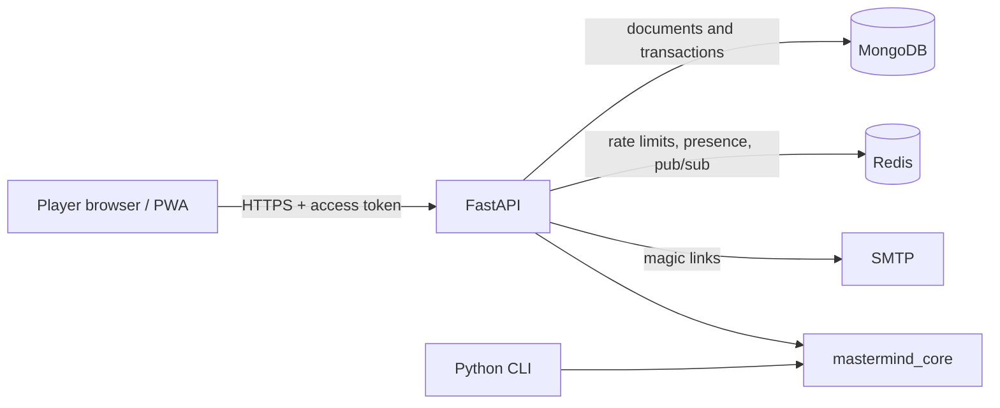

# System overview

- `apps/api` validates first-party access tokens, checks the live session record, authorizes every resource, encrypts persisted game secrets, and exposes HTTP/WebSocket routes.
- `apps/web` establishes a guest session through the API, keeps the access token in memory, and relies on an HttpOnly rotating refresh cookie. It never computes accepted feedback or score.
- `mastermind_core` is the canonical pure rules/scoring engine shared by API and CLI.
- MongoDB is the source of truth. Replica-set transactions protect multi-document room, account, and audit mutations.
- Redis is disposable coordination infrastructure. Redis loss must not alter stored game outcomes.

Guest creation writes an `auth_users` document and a hashed `auth_sessions` refresh token. Email verification upgrades that identity in place or signs into an existing identity. Refresh reuse revokes the session family. TOTP secrets and active game secrets use the configured AES keyring.

Readiness reports MongoDB and Redis dependency state. New integrity-sensitive work fails closed when its required dependency is unavailable; liveness remains available for orchestration.
