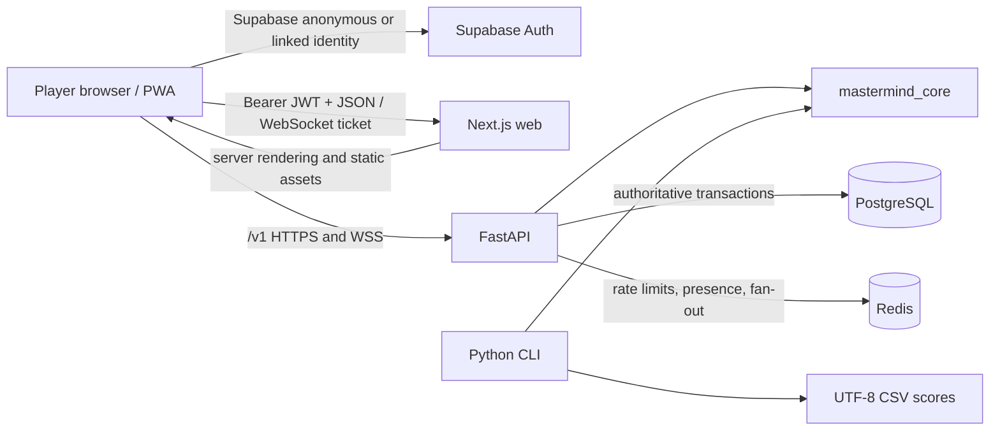

# System overview

Cipherboard is a server-authoritative Mastermind product delivered as a pnpm/uv monorepo. The browser renders the board and keeps only the unsubmitted row locally. The Python API owns secrets, validation, attempt order, scores, ranking, achievements, and multiplayer outcomes.

## Runtime boundaries

- `packages/mastermind_core` is pure Python and contains the only rule, feedback, validation, transition, generation, daily derivation, and scoring implementations. It has no database or framework dependency.
- `apps/api` is FastAPI with Pydantic v2 and SQLAlchemy 2. It validates Supabase JWTs, authorizes every resource, encrypts persisted secrets, locks game rows while accepting attempts, and exposes `/v1` plus health and metrics routes.
- `apps/web` is a strict TypeScript Next.js App Router PWA. It uses Supabase anonymous sign-in for immediate guest play, links the same identity during upgrade, and sends JWTs to the API. It never computes accepted feedback or score.
- `apps/cli` is the school-facing interface. It imports the same core, stores local high scores in `data/high_scores.csv`, and requires no terminal framework.
- PostgreSQL is the source of truth. Redis is disposable coordination infrastructure: rate limiting, presence, room fan-out, and cache. Redis loss must not alter stored game outcomes.

## Request flow

1. Supabase issues a signed JWT for an anonymous or registered identity.
2. The API verifies signature, issuer, audience, expiry, subject, and permitted algorithm against the provider JWKS.
3. A principal is constructed once and resource access is scoped by that subject in SQL.
4. An attempt transaction locks the game row, checks activity and idempotency, validates the guess through `mastermind_core`, writes one immutable attempt, and finalizes score, leaderboard, and achievements atomically.
5. Safe real-time events are published only after commit. Active secrets and opponent guesses never enter browser events, logs, analytics, or exports.

## Versioning

- Public API: `/v1`
- Rule set: `rules_v1`
- Scoring: `score_v1`
- Daily derivation: `daily_v1`

Persisted sessions carry all three applicable versions so old games remain reproducible after later rule changes.

## Failure model

- Database unavailable: readiness fails and all state-changing gameplay is rejected.
- Redis unavailable: readiness is degraded; ranked, invite, room, and race-sensitive operations fail closed. PostgreSQL data remains valid.
- Auth unavailable or unverifiable: protected operations fail closed.
- Analytics unavailable: gameplay continues; the product event is dropped without containing private game data.
- Secret key unavailable: the API returns a generic operational error and never creates a replacement production key.

See [API design](API_DESIGN.md), [data model](DATA_MODEL.md), [real-time design](REALTIME.md), and [scoring](SCORING_AND_RANKING.md).
