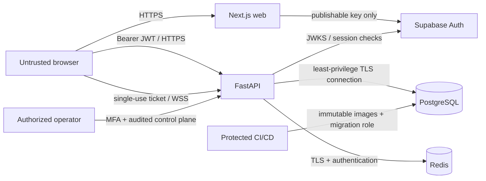

# Threat model

## Scope and assets

This model covers the public web application, FastAPI, Supabase Auth, PostgreSQL, Redis, WebSockets, build pipeline, administrator interface, and operational tooling. The highest-value assets are active secret codes, authentication sessions, user privacy data, ranked-game integrity, administrative authority, invite capability tokens, cryptographic key material, audit evidence, and availability during live rooms.

The intended audience is 13 and above. The product does not collect date of birth, use advertising trackers, or require a real name.

## Trust boundaries

Everything from a browser is hostile, including identifiers, timestamps, idempotency keys, locale strings, display names, and WebSocket messages. Proxy headers are trusted only from configured proxy addresses. Supabase JWT claims are trusted only after full cryptographic and semantic validation. Redis is coordination infrastructure, not authority.

## Abuse cases and mitigations

| Threat | Example | Required mitigations | Detection |
|---|---|---|---|
| Secret-code disclosure | Active secret appears in a response, log, event, browser store, trace, or analytics payload | AES-256-GCM at rest; explicit response/event DTOs; no body logging; recursive redaction; no secret in analytics; reveal only after allowed terminal state | Serialization/log scanning tests; DLP/error-report review |
| Authentication bypass | Missing, forged, expired, wrong-issuer, or wrong-audience JWT accepted | Bearer required; asymmetric JWKS verification; exact issuer/audience; algorithm allowlist; required `exp/iat/sub`; UUID subject; fail closed | Auth failure counters by category; tests for every invalid case |
| Stale/revoked session | Deleted or banned user keeps using an unexpired access token | Short token TTL; signed `session_id`, AAL2 and recent-auth checks for admin; deny pending/deleted/banned profiles; revoke sessions before Auth deletion; documented residual window because hosted Auth session rows are not in the application database | Restricted-account access alerts; audit correlation |
| Authorization failure / IDOR | Player reads, mutates, revokes, or joins another user's resource by changing an ID | Opaque public IDs plus SQL owner/member predicates; membership recheck on sockets; separate public/private serializers; deny by default | 403/404 anomaly counts; BOLA integration tests |
| Leaderboard manipulation | Client submits score/time, modifies custom rules, replays a win, or races final attempt | Server-only rules/secret/clock/score; official-config allowlist; row lock; unique official run and leaderboard row; review state; admin invalidation audit | Score distribution/anomaly metrics; concurrency tests |
| Replayed attempts / idempotency abuse | Retry consumes another turn or same key is reused with a new guess | Per-game idempotency key + request fingerprint; unique constraints; session row lock; cached original outcome; conflict on payload mismatch | Duplicate/conflict counters and request IDs |
| Invite enumeration | Attacker scans sequential friend or room codes | 128–192+ bits randomness; store only digest; generic not-found result; per-account/IP limits; expiry and revocation | Invalid-token rate and source diversity alerts |
| XSS | Display name or challenge title injects script or misleading bidirectional text | NFKC normalization; bounded text; reject control/bidi formatting; React escaping; no unsafe raw HTML; CSP; output encoding by context | CSP reports where configured; payload tests |
| CSRF | Browser cookies cause an unwanted mutation | Public API accepts explicit Bearer auth, not ambient auth cookies; exact CORS; Auth callback state/PKCE and Origin validation; SameSite/Secure cookies where used | Origin rejection metrics; integration tests |
| JWT theft | Script, extension, log, or query URL obtains an access token | Strict CSP; no third-party trackers; secure session handling; never place JWT in URL or log; short lifetime and refresh rotation; session revocation | Token-pattern log scanning; anomalous session use |
| Service credential leakage | Supabase secret/service key appears in browser bundle or repository | Browser receives publishable key only; secret manager for server values; environment separation; secret scanning; protected CI environments | Bundle scan; GitHub secret scanning; rotation drill |
| SQL injection | User sort/filter text changes a query | SQLAlchemy bound parameters; allowlisted identifiers/order; no interpolated SQL; least-privilege runtime role | Error/anomaly monitoring; SAST and hostile-input tests |
| Rate-limit bypass | Spoofed forwarded IP or many guest accounts evade quotas | Trust proxy headers only from allowlist; combined IP/profile/resource keys; Supabase CAPTCHA and Auth limits; atomic Redis counters | Limit-hit metrics and distributed-source alerts |
| WebSocket abuse | Oversized frames, floods, ticket replay, unauthorized reconnect, slow consumer | Single-use scoped ticket; membership recheck; 4 KiB limit; schema/version validation; heartbeat; rate/concurrency caps; bounded queues | Close reason, rejected message, queue and socket metrics |
| Denial of service | Expensive pagination, connection churn, request bodies, or DB locks exhaust resources | Body/page/time limits; connection pools; statement/lock timeout; caching; load tests; readiness; autoscaling; fail-closed ranked writes | Saturation, p95/p99, lock wait and 5xx alerts |
| Dependency compromise | Malicious/transitively changed package or base image enters a release | Lockfiles; exact direct versions; vulnerability and license scans; CodeQL; immutable images; review dependency diffs; minimal non-root images | Dependabot/dependency review; SBOM and registry scan |
| Log leakage | Tokens, emails, guesses, secrets, or invite codes enter logs/traces | Structured allowlist logging; no body/query logging; redaction before serialization and error reporting; pseudonymous IDs | Automated canary scan; restricted log access audit |
| Admin privilege escalation | Hidden route or editable metadata grants admin | Server-side role lookup; permanent account only; recent auth/MFA; no `user_metadata`; deny by default; audit every read/mutation where sensitive | Admin auth failures; immutable audit trail review |
| Encryption key loss/mismatch | Deployment cannot decrypt active sessions and silently regenerates a key | Versioned external key ring; startup validation; missing key returns safe 503; backups and rotation rehearsal; never auto-generate outside explicit local bootstrap | Decrypt failure alert and readiness degradation |
| Account deletion race | Auth identity is removed while public data remains or retries duplicate work | Deletion state machine/saga; hide first; revoke sessions; idempotent anonymization; retry queue; retention policy | Pending-deletion age alert; audit reconciliation |

## Security assumptions

- Production ingress terminates modern TLS, overwrites forwarded headers, and restricts direct container access.
- PostgreSQL, Redis, container registry, CI environments, backups, and secret manager are private and access-controlled with MFA.
- Database point-in-time recovery and restore drills are available from the chosen managed provider.
- Operators do not have routine access to raw production secrets or database owner credentials.
- Legal entity, jurisdiction, support address, policy dates, and processor contracts are configured and reviewed before launch.

If an assumption is not true, launch is blocked until a compensating control is documented and tested.

## Verification cadence

Auth, resource authorization, idempotency, concurrency, key rotation, admin, secret leakage, and account-deletion tests run in CI. Dependency and static scans run on pull requests and weekly. A restore and key-rotation exercise runs at least quarterly. The threat model is reviewed for every new externally reachable mode, data category, processor, or administrative capability and at least every six months.
